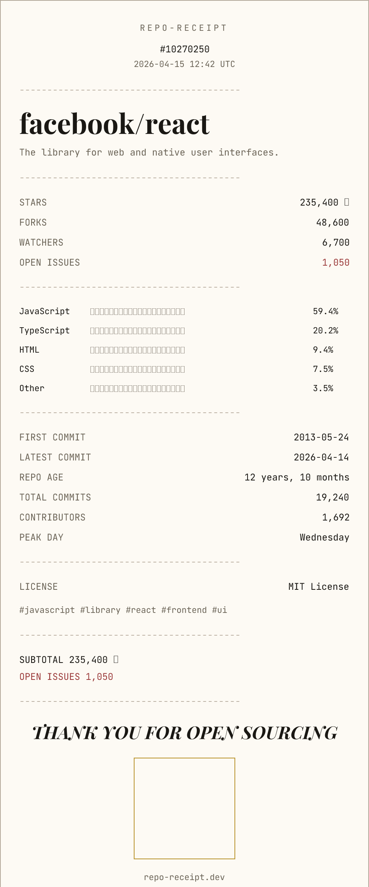

# repo-receipt

Every repo has a receipt.

repo-receipt turns any public GitHub repository into a shareable print-style receipt image. Paste a repo URL, inspect the live HTML receipt instantly, then download or embed a high-resolution PNG generated from the same data model.

[](https://your-domain.example)

## Tech stack

- Next.js 15 App Router
- TypeScript
- Tailwind CSS v4 for layout utilities
- Satori + sharp for PNG generation
- Upstash Redis for optional 24-hour image caching
- GitHub GraphQL + REST APIs for repo data

## Self-hosting

Copy `.env.example` to `.env.local` and set:

- `GITHUB_TOKEN`: optional but strongly recommended for higher public-repo rate limits
- `NEXT_PUBLIC_APP_NAME`: public-facing app name used in metadata and UI
- `NEXT_PUBLIC_SITE_URL`: canonical public base URL used for embeds and metadata
- `UPSTASH_REDIS_REST_URL`: optional Redis cache URL
- `UPSTASH_REDIS_REST_TOKEN`: optional Redis cache token

Then run:

```bash
pnpm install
pnpm dev
```

## Contributing

See [CONTRIBUTING.md](./CONTRIBUTING.md) for architecture notes, local setup, and the receipt renderer constraints.
